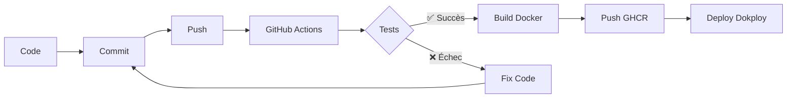

# 🚀 CI/CD Quick Start Guide

Guide rapide pour démarrer avec le pipeline CI/CD de ONCC-V1.

---

## 📋 Prérequis

- [ ] Repository GitHub configuré
- [ ] Compte GitHub avec accès au repository
- [ ] Dokploy installé sur votre serveur (optionnel pour le déploiement)

---

## ⚡ Configuration en 5 Minutes

### 1. Configurer les GitHub Secrets

Allez dans **Settings > Secrets and variables > Actions** de votre repository GitHub.

Ajoutez les secrets suivants :

```bash
# Frontend
NEXT_PUBLIC_APP_NAME=ONCC-V1
NEXT_PUBLIC_APP_DESCRIPTION=Gestion des chaînes d'approvisionnement
NEXT_PUBLIC_API_URL=https://api.votre-domaine.com
NEXT_PUBLIC_API_VERSION=v1
NEXT_PUBLIC_INDEXEDDB_NAME=oncc_db
NEXTAUTH_URL=https://votre-domaine.com
NEXTAUTH_SECRET=<générer avec: openssl rand -base64 32>
```

### 2. Activer GitHub Actions

Le workflow `.github/workflows/ci-cd.yml` est déjà configuré.

Il se déclenche automatiquement sur :
- ✅ Push vers `master`, `main`, ou `develop`
- ✅ Tags (ex: `v1.0.0`)
- ✅ Pull Requests vers `master` ou `main`

### 3. Premier Déploiement

```bash
# Commiter un changement
git add .
git commit -m "feat: initial deployment"
git push origin master
```

GitHub Actions va automatiquement :
1. ✅ Tester le backend (lint, typecheck, tests)
2. ✅ Tester le frontend (lint, build)
3. ✅ Builder les images Docker
4. ✅ Pousser vers GHCR (GitHub Container Registry)

### 4. Vérifier le Workflow

Allez dans **Actions** de votre repository GitHub.

Vous verrez le workflow en cours d'exécution :
- 🟡 Jaune : En cours
- 🟢 Vert : Succès
- 🔴 Rouge : Échec (voir les logs)

---

## 📦 Récupérer les Images

Une fois le workflow terminé, les images sont disponibles sur GHCR.

### Connexion à GHCR

```bash
# Créer un Personal Access Token (PAT)
# GitHub > Settings > Developer settings > Personal access tokens > Tokens (classic)
# Permissions: read:packages

# Se connecter
docker login ghcr.io -u VOTRE_USERNAME_GITHUB
# Password: Votre PAT
```

### Pull des Images

```bash
# Remplacer VOTRE_ORG/VOTRE_REPO par votre repository
docker pull ghcr.io/VOTRE_ORG/VOTRE_REPO/backend:latest
docker pull ghcr.io/VOTRE_ORG/VOTRE_REPO/frontend:latest
```

**Exemple** : Si votre repo est `github.com/stdigital/oncc-v1` :

```bash
docker pull ghcr.io/stdigital/oncc-v1/backend:latest
docker pull ghcr.io/stdigital/oncc-v1/frontend:latest
```

---

## 🐳 Déployer avec Docker Compose

### 1. Créer `docker-compose.prod.yml`

```yaml
version: '3.8'

services:
  postgres:
    image: postgres:15-alpine
    environment:
      POSTGRES_DB: oncc_db
      POSTGRES_USER: oncc_user
      POSTGRES_PASSWORD: ${DB_PASSWORD}
    volumes:
      - postgres_data:/var/lib/postgresql/data
    networks:
      - oncc_network

  redis:
    image: redis:7-alpine
    networks:
      - oncc_network

  minio:
    image: minio/minio:latest
    command: server /data --console-address ":9001"
    environment:
      MINIO_ROOT_USER: ${MINIO_ROOT_USER}
      MINIO_ROOT_PASSWORD: ${MINIO_ROOT_PASSWORD}
    volumes:
      - minio_data:/data
    networks:
      - oncc_network

  backend:
    image: ghcr.io/VOTRE_ORG/VOTRE_REPO/backend:latest
    environment:
      NODE_ENV: production
      PORT: 3333
      DB_HOST: postgres
      DB_PORT: 5432
      DB_USER: oncc_user
      DB_PASSWORD: ${DB_PASSWORD}
      DB_DATABASE: oncc_db
      REDIS_HOST: redis
      REDIS_PORT: 6379
      MINIO_ENDPOINT: minio
      MINIO_PORT: 9000
      MINIO_USE_SSL: "false"
      MINIO_ACCESS_KEY: ${MINIO_ROOT_USER}
      MINIO_SECRET_KEY: ${MINIO_ROOT_PASSWORD}
      MINIO_BUCKET: oncc-uploads
      APP_KEY: ${APP_KEY}
      SESSION_DRIVER: redis
    ports:
      - "3333:3333"
    depends_on:
      - postgres
      - redis
      - minio
    networks:
      - oncc_network

  frontend:
    image: ghcr.io/VOTRE_ORG/VOTRE_REPO/frontend:latest
    environment:
      NODE_ENV: production
      PORT: 3000
      NEXT_PUBLIC_API_URL: ${NEXT_PUBLIC_API_URL}
      NEXTAUTH_URL: ${NEXTAUTH_URL}
      NEXTAUTH_SECRET: ${NEXTAUTH_SECRET}
    ports:
      - "3000:3000"
    depends_on:
      - backend
    networks:
      - oncc_network

volumes:
  postgres_data:
  minio_data:

networks:
  oncc_network:
    driver: bridge
```

### 2. Créer `.env`

```bash
# Database
DB_PASSWORD=votre_mot_de_passe_securise

# MinIO
MINIO_ROOT_USER=minio_admin
MINIO_ROOT_PASSWORD=votre_mot_de_passe_minio_securise

# Backend
APP_KEY=generer_avec_node_ace_generate_key

# Frontend
NEXT_PUBLIC_API_URL=https://api.votre-domaine.com
NEXTAUTH_URL=https://votre-domaine.com
NEXTAUTH_SECRET=generer_avec_openssl_rand_-base64_32
```

### 3. Démarrer

```bash
docker-compose -f docker-compose.prod.yml up -d
```

### 4. Initialiser la DB

```bash
docker exec -it oncc_backend sh
node ace migration:run
node ace db:seed
exit
```

---

## 🏷️ Versioning avec Tags

Pour créer une release versionnée :

```bash
# Créer un tag
git tag -a v1.0.0 -m "Release v1.0.0"
git push origin v1.0.0
```

GitHub Actions va automatiquement :
- Builder les images
- Les taguer avec `v1.0.0`, `1.0`, `1`, et `latest`
- Les pousser vers GHCR

Pour utiliser une version spécifique :

```bash
docker pull ghcr.io/VOTRE_ORG/VOTRE_REPO/backend:v1.0.0
docker pull ghcr.io/VOTRE_ORG/VOTRE_REPO/frontend:v1.0.0
```

---

## 🔍 Vérifications

### Voir les Images Disponibles

Allez sur **Packages** de votre repository GitHub.

Vous verrez :
- `backend` - Image Docker du backend
- `frontend` - Image Docker du frontend

Cliquez sur une image pour voir tous les tags disponibles.

### Logs GitHub Actions

```bash
# Dans l'interface GitHub
Actions > Sélectionner un workflow > Voir les logs de chaque job
```

### Logs Docker

```bash
# Backend
docker logs -f oncc_backend

# Frontend
docker logs -f oncc_frontend

# Tous les services
docker-compose -f docker-compose.prod.yml logs -f
```

---

## 🛠️ Commandes Utiles

### Mise à Jour

```bash
# Pull les nouvelles images
docker pull ghcr.io/VOTRE_ORG/VOTRE_REPO/backend:latest
docker pull ghcr.io/VOTRE_ORG/VOTRE_REPO/frontend:latest

# Recréer les containers
docker-compose -f docker-compose.prod.yml up -d --force-recreate
```

### Redémarrage

```bash
# Redémarrer un service
docker restart oncc_backend
docker restart oncc_frontend

# Redémarrer tous les services
docker-compose -f docker-compose.prod.yml restart
```

### Nettoyage

```bash
# Supprimer les anciennes images
docker image prune -a

# Supprimer les volumes non utilisés
docker volume prune
```

---

## 📊 Workflow de Développement



### Étapes Détaillées

1. **Développement Local**
   ```bash
   # Backend
   cd backend
   npm run docker:dev

   # Frontend
   cd frontend
   npm run dev
   ```

2. **Tests Locaux**
   ```bash
   # Backend
   npm run test
   npm run lint
   npm run typecheck

   # Frontend
   npm run lint
   npm run build
   ```

3. **Commit & Push**
   ```bash
   git add .
   git commit -m "feat: nouvelle fonctionnalité"
   git push origin feature/ma-branche
   ```

4. **Pull Request**
   - Créer une PR sur GitHub
   - GitHub Actions teste automatiquement
   - Review du code
   - Merge vers `master`

5. **Déploiement Automatique**
   - GitHub Actions rebuild sur `master`
   - Nouvelles images sur GHCR
   - Pull sur Dokploy
   - Redémarrage des containers

---

## 🆘 Troubleshooting

### Workflow Échoue

**1. Tests Backend Échouent**
```bash
# Vérifier les logs dans GitHub Actions
# Corriger le code
# Re-pousser
```

**2. Build Frontend Échoue**
```bash
# Vérifier que les variables NEXT_PUBLIC_* sont définies
# Vérifier les GitHub Secrets
```

**3. Docker Build Échoue**
```bash
# Vérifier le Dockerfile
# Tester localement:
docker build -t test-backend ./backend
docker build -t test-frontend ./frontend
```

### Images Non Disponibles sur GHCR

**1. Visibilité Privée**
```bash
# Aller sur Packages > backend/frontend
# Package settings > Change visibility > Public
```

**2. Permissions Insuffisantes**
```bash
# Le workflow utilise GITHUB_TOKEN automatique
# Vérifier Settings > Actions > General > Workflow permissions
# Doit être "Read and write permissions"
```

### Connexion GHCR Échoue

```bash
# Régénérer le PAT avec la permission "read:packages"
# Se reconnecter
docker logout ghcr.io
docker login ghcr.io -u VOTRE_USERNAME
```

---

## 📚 Documentation Complète

Pour plus de détails, consultez :
- **[DEPLOYMENT.md](./DEPLOYMENT.md)** - Guide complet de déploiement
- **[Backend .env.example](./backend/.env.example)** - Variables backend
- **[Frontend .env.example](./frontend/.env.example)** - Variables frontend
- **[GitHub Actions Workflow](./.github/workflows/ci-cd.yml)** - Configuration CI/CD

---

## ✅ Checklist de Premier Déploiement

- [ ] GitHub Secrets configurés
- [ ] Premier commit poussé sur `master`
- [ ] Workflow GitHub Actions ✅ vert
- [ ] Images disponibles sur GHCR
- [ ] Personal Access Token (PAT) créé
- [ ] Connexion GHCR réussie
- [ ] Images pullées sur le serveur
- [ ] `docker-compose.prod.yml` créé
- [ ] `.env` configuré avec des mots de passe sécurisés
- [ ] Services démarrés
- [ ] Migrations exécutées
- [ ] Seeders exécutés
- [ ] Application accessible
- [ ] Reverse proxy configuré (Nginx/Traefik)
- [ ] SSL/TLS configuré (Let's Encrypt)

---

**🎉 Votre CI/CD est prête ! Bon déploiement !**
