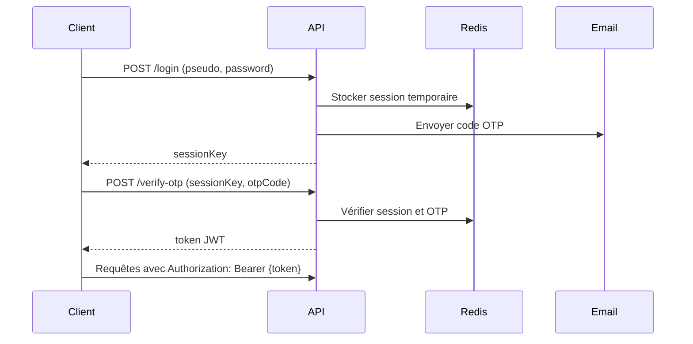

# Documentation API - SIFC

## Vue d'ensemble

Cette documentation décrit l'API REST du système SIFC (Système d'Information de la Filière Cacao et Café). L'API suit les conventions REST et utilise JSON pour les échanges de données.

## URL de base

- **Développement** : `http://localhost:3333/api/v1`
- **Production** : `https://api.sifc.oncc.cm/api/v1`

## Authentification

L'API utilise un système d'authentification en deux étapes avec OTP (One-Time Password).

### Flux d'authentification



### Headers requis

```http
Content-Type: application/json
Authorization: Bearer {token}  # Pour les routes protégées
Accept: application/json
```

## Endpoints

### 1. Authentification

#### POST /login

Initie le processus d'authentification.

**Paramètres :**

```json
{
  "pseudo": "string",
  "password": "string"
}
```

**Réponse (200) :**

```json
{
  "success": true,
  "message": "Code OTP envoyé par email",
  "sessionKey": "uuid-session-key",
  "expiresIn": 300
}
```

**Erreurs :**

- `400` : Données invalides
- `401` : Identifiants incorrects
- `429` : Trop de tentatives

#### POST /verify-otp

Vérifie le code OTP et retourne le token JWT.

**Paramètres :**

```json
{
  "sessionKey": "string",
  "otpCode": "string"
}
```

**Réponse (200) :**

```json
{
  "success": true,
  "message": "Authentification réussie",
  "token": "jwt-token",
  "user": {
    "id": 1,
    "uuid": "uuid",
    "pseudo": "admin",
    "nom": "Doe",
    "prenom": "John",
    "email": "john@example.com",
    "role": "technical_admin",
    "langue": "fr"
  },
  "expiresIn": 86400
}
```

#### POST /logout

Déconnecte l'utilisateur.

**Headers :** `Authorization: Bearer {token}`

**Réponse (200) :**

```json
{
  "success": true,
  "message": "Déconnexion réussie"
}
```

#### POST /refresh-token

Renouvelle le token JWT.

**Headers :** `Authorization: Bearer {token}`

**Réponse (200) :**

```json
{
  "success": true,
  "token": "new-jwt-token",
  "expiresIn": 86400
}
```

### 2. Récupération de compte

#### POST /forgot-password

Initie la récupération de compte via questions de sécurité.

**Paramètres :**

```json
{
  "pseudo": "string"
}
```

**Réponse (200) :**

```json
{
  "success": true,
  "message": "Questions de sécurité récupérées",
  "sessionKey": "uuid",
  "questions": [
    {
      "id": 1,
      "question": "Quel est le nom de votre premier animal ?"
    },
    {
      "id": 2,
      "question": "Dans quelle ville êtes-vous né ?"
    },
    {
      "id": 3,
      "question": "Nom de jeune fille de votre mère ?"
    }
  ]
}
```

#### POST /verify-security-answers

Vérifie les réponses aux questions de sécurité.

**Paramètres :**

```json
{
  "sessionKey": "string",
  "answers": [
    {
      "id": 1,
      "answer": "string"
    },
    {
      "id": 2,
      "answer": "string"
    },
    {
      "id": 3,
      "answer": "string"
    }
  ]
}
```

**Réponse (200) :**

```json
{
  "success": true,
  "message": "Réponses correctes",
  "resetToken": "uuid"
}
```

#### POST /reset-password

Réinitialise le mot de passe.

**Paramètres :**

```json
{
  "resetToken": "string",
  "newPassword": "string",
  "confirmPassword": "string"
}
```

**Réponse (200) :**

```json
{
  "success": true,
  "message": "Mot de passe réinitialisé avec succès"
}
```

### 3. Gestion des utilisateurs

#### GET /users

Liste les utilisateurs (admin uniquement).

**Headers :** `Authorization: Bearer {token}`

**Paramètres de requête :**

- `page` : Numéro de page (défaut: 1)
- `limit` : Nombre d'éléments par page (défaut: 20)
- `role` : Filtrer par rôle
- `search` : Recherche par nom/prénom/pseudo

**Réponse (200) :**

```json
{
  "success": true,
  "data": [
    {
      "id": 1,
      "uuid": "uuid",
      "pseudo": "admin",
      "nom": "Doe",
      "prenom": "John",
      "email": "john@example.com",
      "role": "technical_admin",
      "langue": "fr",
      "createdAt": "2024-01-15T10:00:00.000Z",
      "updatedAt": "2024-01-15T10:00:00.000Z"
    }
  ],
  "meta": {
    "total": 1,
    "perPage": 20,
    "currentPage": 1,
    "lastPage": 1,
    "firstPage": 1,
    "firstPageUrl": "/?page=1",
    "lastPageUrl": "/?page=1",
    "nextPageUrl": null,
    "previousPageUrl": null
  }
}
```

#### GET /users/:id

Récupère un utilisateur spécifique.

**Headers :** `Authorization: Bearer {token}`

**Réponse (200) :**

```json
{
  "success": true,
  "data": {
    "id": 1,
    "uuid": "uuid",
    "pseudo": "admin",
    "nom": "Doe",
    "prenom": "John",
    "email": "john@example.com",
    "role": "technical_admin",
    "langue": "fr",
    "createdAt": "2024-01-15T10:00:00.000Z",
    "updatedAt": "2024-01-15T10:00:00.000Z"
  }
}
```

#### POST /users

Crée un nouvel utilisateur (admin uniquement).

**Headers :** `Authorization: Bearer {token}`

**Paramètres :**

```json
{
  "pseudo": "string",
  "nom": "string",
  "prenom": "string",
  "email": "string",
  "password": "string",
  "role": "technical_admin|bassin_admin|field_agent|gerant",
  "langue": "fr|en",
  "securityQuestion1": "string",
  "securityAnswer1": "string",
  "securityQuestion2": "string",
  "securityAnswer2": "string",
  "securityQuestion3": "string",
  "securityAnswer3": "string"
}
```

**Réponse (201) :**

```json
{
  "success": true,
  "message": "Utilisateur créé avec succès",
  "data": {
    "id": 2,
    "uuid": "new-uuid",
    "pseudo": "newuser",
    "nom": "Smith",
    "prenom": "Jane",
    "email": "jane@example.com",
    "role": "field_agent",
    "langue": "fr"
  }
}
```

#### PUT /users/:id

Met à jour un utilisateur.

**Headers :** `Authorization: Bearer {token}`

**Paramètres :**

```json
{
  "nom": "string",
  "prenom": "string",
  "email": "string",
  "langue": "fr|en"
}
```

**Réponse (200) :**

```json
{
  "success": true,
  "message": "Utilisateur mis à jour",
  "data": {
    "id": 1,
    "uuid": "uuid",
    "pseudo": "admin",
    "nom": "Updated Name",
    "prenom": "Updated Firstname",
    "email": "updated@example.com",
    "role": "technical_admin",
    "langue": "fr"
  }
}
```

#### DELETE /users/:id

Supprime un utilisateur (admin uniquement).

**Headers :** `Authorization: Bearer {token}`

**Réponse (200) :**

```json
{
  "success": true,
  "message": "Utilisateur supprimé avec succès"
}
```

### 4. Profil utilisateur

#### GET /profile

Récupère le profil de l'utilisateur connecté.

**Headers :** `Authorization: Bearer {token}`

**Réponse (200) :**

```json
{
  "success": true,
  "data": {
    "id": 1,
    "uuid": "uuid",
    "pseudo": "admin",
    "nom": "Doe",
    "prenom": "John",
    "email": "john@example.com",
    "role": "technical_admin",
    "langue": "fr",
    "mustChangePassword": false,
    "createdAt": "2024-01-15T10:00:00.000Z",
    "updatedAt": "2024-01-15T10:00:00.000Z"
  }
}
```

#### PUT /profile

Met à jour le profil de l'utilisateur connecté.

**Headers :** `Authorization: Bearer {token}`

**Paramètres :**

```json
{
  "nom": "string",
  "prenom": "string",
  "email": "string",
  "langue": "fr|en"
}
```

#### PUT /profile/password

Change le mot de passe de l'utilisateur connecté.

**Headers :** `Authorization: Bearer {token}`

**Paramètres :**

```json
{
  "currentPassword": "string",
  "newPassword": "string",
  "confirmPassword": "string"
}
```

**Réponse (200) :**

```json
{
  "success": true,
  "message": "Mot de passe mis à jour avec succès"
}
```

### 5. Santé de l'API

#### GET /health

Vérifie l'état de l'API et des services.

**Réponse (200) :**

```json
{
  "success": true,
  "status": "healthy",
  "timestamp": "2024-01-15T10:00:00.000Z",
  "services": {
    "database": "healthy",
    "redis": "healthy",
    "email": "healthy"
  },
  "version": "1.0.0",
  "uptime": 3600
}
```

## Codes de statut HTTP

| Code | Description                     |
| ---- | ------------------------------- |
| 200  | Succès                          |
| 201  | Créé                            |
| 400  | Requête invalide                |
| 401  | Non authentifié                 |
| 403  | Accès refusé                    |
| 404  | Ressource non trouvée           |
| 422  | Données de validation invalides |
| 429  | Trop de requêtes                |
| 500  | Erreur serveur interne          |

## Format des erreurs

```json
{
  "success": false,
  "message": "Description de l'erreur",
  "errors": [
    {
      "field": "email",
      "rule": "email",
      "message": "L'email doit être valide"
    }
  ],
  "code": "VALIDATION_ERROR"
}
```

## Pagination

Les endpoints qui retournent des listes utilisent la pagination :

```json
{
  "data": [...],
  "meta": {
    "total": 100,
    "perPage": 20,
    "currentPage": 1,
    "lastPage": 5,
    "firstPage": 1,
    "firstPageUrl": "/?page=1",
    "lastPageUrl": "/?page=5",
    "nextPageUrl": "/?page=2",
    "previousPageUrl": null
  }
}
```

## Rate Limiting

L'API implémente un système de limitation de taux :

- **Authentification** : 5 tentatives par minute par IP
- **API générale** : 100 requêtes par minute par utilisateur
- **Création d'utilisateurs** : 10 créations par heure par admin

Headers de réponse :

```http
X-RateLimit-Limit: 100
X-RateLimit-Remaining: 95
X-RateLimit-Reset: 1642248000
```

## Exemples d'utilisation

### JavaScript/Fetch

```javascript
// Authentification
const loginResponse = await fetch('/api/v1/login', {
  method: 'POST',
  headers: {
    'Content-Type': 'application/json',
  },
  body: JSON.stringify({
    pseudo: 'admin',
    password: 'password123',
  }),
})

const { sessionKey } = await loginResponse.json()

// Vérification OTP
const otpResponse = await fetch('/api/v1/verify-otp', {
  method: 'POST',
  headers: {
    'Content-Type': 'application/json',
  },
  body: JSON.stringify({
    sessionKey,
    otpCode: '123456',
  }),
})

const { token } = await otpResponse.json()

// Requête authentifiée
const usersResponse = await fetch('/api/v1/users', {
  headers: {
    'Authorization': `Bearer ${token}`,
    'Content-Type': 'application/json',
  },
})

const users = await usersResponse.json()
```

### cURL

```bash
# Authentification
curl -X POST http://localhost:3333/api/v1/login \
  -H "Content-Type: application/json" \
  -d '{"pseudo":"admin","password":"password123"}'

# Vérification OTP
curl -X POST http://localhost:3333/api/v1/verify-otp \
  -H "Content-Type: application/json" \
  -d '{"sessionKey":"session-key","otpCode":"123456"}'

# Requête authentifiée
curl -X GET http://localhost:3333/api/v1/users \
  -H "Authorization: Bearer jwt-token" \
  -H "Content-Type: application/json"
```

### Python/Requests

```python
import requests

# Authentification
login_response = requests.post('http://localhost:3333/api/v1/login', json={
    'pseudo': 'admin',
    'password': 'password123'
})
session_key = login_response.json()['sessionKey']

# Vérification OTP
otp_response = requests.post('http://localhost:3333/api/v1/verify-otp', json={
    'sessionKey': session_key,
    'otpCode': '123456'
})
token = otp_response.json()['token']

# Requête authentifiée
headers = {'Authorization': f'Bearer {token}'}
users_response = requests.get('http://localhost:3333/api/v1/users', headers=headers)
users = users_response.json()
```

## Collection Postman

Une collection Postman est disponible dans le dossier `docs/postman/` avec :

- Tous les endpoints configurés
- Variables d'environnement
- Scripts de test automatiques
- Gestion automatique des tokens

## Tests automatisés

Les tests d'API sont disponibles dans `tests/functional/` :

```bash
# Lancer les tests d'API
npm run test:api

# Tests spécifiques
npm test -- tests/functional/auth.spec.ts
```

## Versioning

L'API utilise le versioning par URL :

- Version actuelle : `v1`
- Versions futures : `v2`, `v3`, etc.

Les versions antérieures sont maintenues pendant 6 mois après la sortie d'une nouvelle version majeure.

## Support et contact

- **Documentation** : [docs.sifc.oncc.cm](https://docs.sifc.oncc.cm)
- **Support technique** : support@oncc.cm
- **Issues GitHub** : [github.com/oncc/sifc-backend/issues](https://github.com/oncc/sifc-backend/issues)

---

_Documentation mise à jour le : 2024-01-15_
