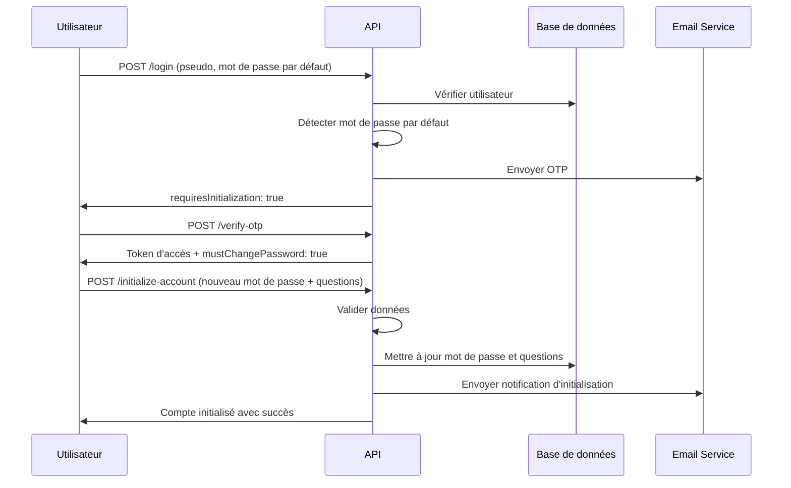

# Initialisation de Compte Utilisateur

## Vue d'ensemble

Le système d'initialisation de compte garantit que tous les utilisateurs créés via le seeder avec un mot de passe par défaut doivent obligatoirement configurer leur compte lors de leur première connexion.

## Processus d'initialisation

### 1. Création d'utilisateur (Seeder)

Lors de la création d'un utilisateur via le seeder :

- **Mot de passe par défaut** : `DEFAULT_PASSWORD` (défini dans `.env`, par défaut `123456`)
- **Flag obligatoire** : `mustChangePassword = true`
- **Statut** : `actif`

### 2. Première connexion

Lors de la première connexion avec le mot de passe par défaut :

**Endpoint** : `POST /api/v1/login`

**Réponse** :

```json
{
  "success": true,
  "message": "Code de vérification envoyé par email",
  "requiresOtp": true,
  "mustChangePassword": true,
  "requiresInitialization": true,
  "sessionKey": "auth_123_1234567890"
}
```

**Indicateurs importants** :

- `mustChangePassword: true` - L'utilisateur doit changer son mot de passe
- `requiresInitialization: true` - L'utilisateur utilise encore le mot de passe par défaut

### 3. Vérification OTP

**Endpoint** : `POST /api/v1/verify-otp`

Après vérification OTP réussie, l'utilisateur reçoit un token d'accès mais doit obligatoirement initialiser son compte.

### 4. Initialisation obligatoire

**Endpoint** : `POST /api/v1/initialize-account`

**Headers** :

```
Authorization: Bearer <token>
```

**Body** :

```json
{
  "newPassword": "MonNouveauMotDePasse123!",
  "newPassword_confirmation": "MonNouveauMotDePasse123!",
  "securityQuestion1": "Quel est le nom de votre premier animal de compagnie ?",
  "securityAnswer1": "Rex",
  "securityQuestion2": "Dans quelle ville êtes-vous né(e) ?",
  "securityAnswer2": "Douala",
  "securityQuestion3": "Quel est votre plat préféré ?",
  "securityAnswer3": "Ndolé"
}
```

**Validation** :

- **Mot de passe** : Minimum 8 caractères, doit contenir majuscule, minuscule, chiffre et caractère spécial
- **Questions de sécurité** : Au moins 2 questions requises (3ème optionnelle)
- **Réponses** : Minimum 2 caractères, maximum 100 caractères

**Réponse de succès** :

```json
{
  "success": true,
  "message": "Compte initialisé avec succès",
  "data": {
    "user": {
      "id": 123,
      "uuid": "...",
      "pseudo": "jdupont",
      "nom": "Dupont",
      "prenom": "Jean",
      "email": "jean.dupont@example.com",
      "role": "field_agent",
      "langue": "fr",
      "mustChangePassword": false
    }
  }
}
```

## Sécurité

### Hachage des réponses de sécurité

- Les réponses sont normalisées (minuscules, espaces supprimés)
- Hachage avec le même algorithme que les mots de passe
- Stockage sécurisé dans la base de données

### Validation des mots de passe

- Minimum 8 caractères
- Au moins une majuscule
- Au moins une minuscule
- Au moins un chiffre
- Au moins un caractère spécial (@$!%\*?&)

### Questions de sécurité

- Minimum 10 caractères pour les questions
- Minimum 2 caractères pour les réponses
- Au moins 2 questions obligatoires
- 3ème question optionnelle

## Notifications

### Email d'initialisation

Un email de confirmation est envoyé après l'initialisation réussie du compte :

- Template : `emails/account_initialized.edge`
- Contenu : Confirmation de l'initialisation, date, conseils de sécurité

## Variables d'environnement

```env
# Mot de passe par défaut pour les comptes créés via seeder
DEFAULT_PASSWORD=123456
```

## Flux de données



## Gestion d'erreurs

### Erreurs courantes

**Compte déjà initialisé** :

```json
{
  "success": false,
  "message": "Ce compte a déjà été initialisé"
}
```

**Mot de passe faible** :

```json
{
  "success": false,
  "message": "Le nouveau mot de passe doit contenir au moins 8 caractères"
}
```

**Questions insuffisantes** :

```json
{
  "success": false,
  "message": "Au moins 2 questions de sécurité sont requises"
}
```

## Tests

### Test d'initialisation

```bash
# 1. Créer un utilisateur avec le seeder
node ace db:seed --files="database/seeders/users_seeder.ts"

# 2. Se connecter avec le mot de passe par défaut
curl -X POST http://localhost:3333/api/v1/login \
  -H "Content-Type: application/json" \
  -d '{"pseudo": "jdupont", "password": "123456"}'

# 3. Vérifier l'OTP
curl -X POST http://localhost:3333/api/v1/verify-otp \
  -H "Content-Type: application/json" \
  -d '{"otp": "123456", "sessionKey": "auth_123_1234567890"}'

# 4. Initialiser le compte
curl -X POST http://localhost:3333/api/v1/initialize-account \
  -H "Authorization: Bearer <token>" \
  -H "Content-Type: application/json" \
  -d '{
    "newPassword": "MonNouveauMotDePasse123!",
    "newPassword_confirmation": "MonNouveauMotDePasse123!",
    "securityQuestion1": "Quel est le nom de votre premier animal de compagnie ?",
    "securityAnswer1": "Rex",
    "securityQuestion2": "Dans quelle ville êtes-vous né(e) ?",
    "securityAnswer2": "Douala"
  }'
```

## Intégration Frontend

Le frontend doit :

1. **Détecter** `requiresInitialization: true` après la connexion
2. **Rediriger** vers la page d'initialisation de compte
3. **Bloquer** l'accès aux autres fonctionnalités tant que le compte n'est pas initialisé
4. **Afficher** un formulaire d'initialisation avec validation côté client
5. **Confirmer** l'initialisation et rediriger vers le tableau de bord

## Maintenance

### Réinitialisation forcée

Pour forcer un utilisateur à réinitialiser son compte :

```sql
UPDATE users
SET must_change_password = true,
    password_hash = '<hash_du_mot_de_passe_par_defaut>'
WHERE id = <user_id>;
```

### Audit

Toutes les initialisations de compte sont tracées dans les logs d'audit automatiquement.
