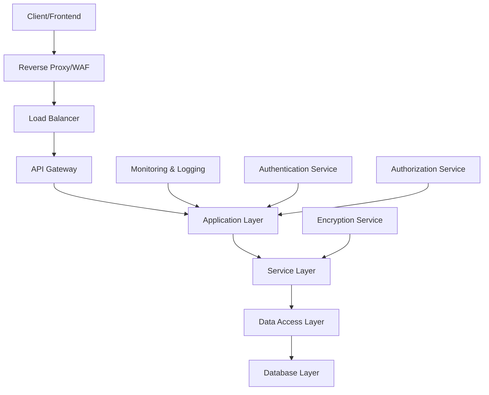

# Guide de Sécurité - SIFC

## Vue d'ensemble

Ce document détaille les mesures de sécurité implémentées dans le système SIFC, les bonnes pratiques à suivre, et les procédures de sécurité pour le développement et la production.

## Architecture de sécurité

### Modèle de sécurité en couches



## Authentification et autorisation

### Système d'authentification 2FA

#### Flux sécurisé

1. **Première étape** : Vérification pseudo/mot de passe
2. **Deuxième étape** : Code OTP envoyé par email
3. **Génération token** : JWT avec expiration courte
4. **Refresh token** : Renouvellement automatique

#### Configuration sécurisée

```typescript
// config/auth.ts
export default defineConfig({
  default: 'api',
  guards: {
    api: {
      driver: 'access_tokens',
      provider: {
        driver: 'lucid',
        identifierKey: 'id',
        uids: ['pseudo', 'email'],
        model: () => import('#models/user'),
      },
      tokenProvider: {
        type: 'api',
        driver: 'database',
        table: 'auth_access_tokens',
        foreignKey: 'tokenable_id',
      },
    },
  },
  providers: {
    users: {
      driver: 'lucid',
      identifierKey: 'id',
      uids: ['pseudo', 'email'],
      model: () => import('#models/user'),
    },
  },
})
```

#### Gestion des sessions OTP

```typescript
// app/services/otp_service.ts
export class OtpService {
  private static readonly OTP_EXPIRY = 5 * 60 // 5 minutes
  private static readonly MAX_ATTEMPTS = 3
  private static readonly LOCKOUT_DURATION = 15 * 60 // 15 minutes

  static async generateOtp(userId: number): Promise<string> {
    const otp = Math.random().toString().slice(2, 8).padStart(6, '0')

    await redis.setex(
      `otp:${userId}`,
      this.OTP_EXPIRY,
      JSON.stringify({
        code: await hash.make(otp),
        attempts: 0,
        createdAt: Date.now(),
      })
    )

    return otp
  }

  static async verifyOtp(userId: number, code: string): Promise<boolean> {
    const otpData = await redis.get(`otp:${userId}`)
    if (!otpData) return false

    const { code: hashedCode, attempts } = JSON.parse(otpData)

    if (attempts >= this.MAX_ATTEMPTS) {
      await this.lockoutUser(userId)
      return false
    }

    const isValid = await hash.verify(hashedCode, code)

    if (!isValid) {
      await this.incrementAttempts(userId)
      return false
    }

    await redis.del(`otp:${userId}`)
    return true
  }
}
```

### Gestion des rôles et permissions

#### Modèle RBAC simplifié

```typescript
// app/models/user.ts
export default class User extends BaseModel {
  @column()
  declare role: 'technical_admin' | 'bassin_admin' | 'field_agent' | 'gerant'

  // Méthodes de vérification des permissions
  canManageUsers(): boolean {
    return this.role === 'technical_admin'
  }

  canManageBassin(bassinId?: number): boolean {
    return (
      this.role === 'technical_admin' ||
      (this.role === 'bassin_admin' && this.bassinId === bassinId)
    )
  }

  canAccessData(dataOwnerId: number): boolean {
    switch (this.role) {
      case 'technical_admin':
        return true
      case 'bassin_admin':
        return this.canAccessBassinData(dataOwnerId)
      case 'field_agent':
      case 'gerant':
        return this.id === dataOwnerId
      default:
        return false
    }
  }
}
```

#### Middleware d'autorisation

```typescript
// app/middleware/authorization_middleware.ts
export default class AuthorizationMiddleware {
  async handle(ctx: HttpContext, next: NextFn, options: AuthOptions) {
    const user = ctx.auth.user!
    const { roles, permissions, resource } = options

    // Vérification des rôles
    if (roles && !roles.includes(user.role)) {
      throw new ForbiddenException('Rôle insuffisant')
    }

    // Vérification des permissions spécifiques
    if (permissions) {
      const hasPermission = permissions.every((permission) =>
        this.checkPermission(user, permission, resource)
      )

      if (!hasPermission) {
        throw new ForbiddenException('Permission insuffisante')
      }
    }

    await next()
  }

  private checkPermission(user: User, permission: string, resource?: any): boolean {
    switch (permission) {
      case 'manage_users':
        return user.canManageUsers()
      case 'manage_bassin':
        return user.canManageBassin(resource?.bassinId)
      case 'access_data':
        return user.canAccessData(resource?.ownerId)
      default:
        return false
    }
  }
}
```

## Sécurité des données

### Chiffrement

#### Chiffrement des mots de passe

```typescript
// app/services/password_service.ts
import { scrypt } from '@adonisjs/core/hash/drivers/scrypt'

export class PasswordService {
  private static readonly SCRYPT_CONFIG = {
    cost: 16384,
    blockSize: 8,
    parallelization: 1,
    maxMemory: 33554432,
  }

  static async hash(password: string): Promise<string> {
    return scrypt.make(password, this.SCRYPT_CONFIG)
  }

  static async verify(hashedPassword: string, plainPassword: string): Promise<boolean> {
    return scrypt.verify(hashedPassword, plainPassword)
  }

  static validateStrength(password: string): boolean {
    const minLength = 8
    const hasUpperCase = /[A-Z]/.test(password)
    const hasLowerCase = /[a-z]/.test(password)
    const hasNumbers = /\d/.test(password)
    const hasSpecialChar = /[!@#$%^&*(),.?":{}|<>]/.test(password)

    return (
      password.length >= minLength && hasUpperCase && hasLowerCase && hasNumbers && hasSpecialChar
    )
  }
}
```

#### Chiffrement des données sensibles

```typescript
// app/services/encryption_service.ts
import { createCipher, createDecipher } from 'crypto'

export class EncryptionService {
  private static readonly ALGORITHM = 'aes-256-gcm'
  private static readonly KEY = env.get('ENCRYPTION_KEY')

  static encrypt(text: string): string {
    const iv = crypto.randomBytes(16)
    const cipher = crypto.createCipher(this.ALGORITHM, this.KEY)
    cipher.setAAD(Buffer.from('SIFC', 'utf8'))

    let encrypted = cipher.update(text, 'utf8', 'hex')
    encrypted += cipher.final('hex')

    const authTag = cipher.getAuthTag()

    return iv.toString('hex') + ':' + authTag.toString('hex') + ':' + encrypted
  }

  static decrypt(encryptedText: string): string {
    const parts = encryptedText.split(':')
    const iv = Buffer.from(parts[0], 'hex')
    const authTag = Buffer.from(parts[1], 'hex')
    const encrypted = parts[2]

    const decipher = crypto.createDecipher(this.ALGORITHM, this.KEY)
    decipher.setAAD(Buffer.from('SIFC', 'utf8'))
    decipher.setAuthTag(authTag)

    let decrypted = decipher.update(encrypted, 'hex', 'utf8')
    decrypted += decipher.final('utf8')

    return decrypted
  }
}
```

### Protection contre les injections SQL

#### Utilisation de l'ORM Lucid

```typescript
// ✅ Sécurisé - Utilisation de l'ORM
const users = await User.query()
  .where('role', role)
  .where('email', 'like', `%${searchTerm}%`)
  .paginate(page, limit)

// ❌ Dangereux - Requête SQL brute non sécurisée
const users = await Database.rawQuery(`SELECT * FROM users WHERE role = '${role}'`)

// ✅ Sécurisé - Requête SQL brute avec paramètres
const users = await Database.rawQuery('SELECT * FROM users WHERE role = ? AND email LIKE ?', [
  role,
  `%${searchTerm}%`,
])
```

#### Validation des entrées

```typescript
// app/validators/create_user_validator.ts
export default class CreateUserValidator {
  constructor(protected ctx: HttpContext) {}

  public schema = schema.create({
    pseudo: schema.string({ trim: true }, [
      rules.minLength(3),
      rules.maxLength(50),
      rules.regex(/^[a-zA-Z0-9_]+$/),
      rules.unique({ table: 'users', column: 'pseudo' }),
    ]),
    email: schema.string({ trim: true }, [
      rules.email(),
      rules.maxLength(255),
      rules.unique({ table: 'users', column: 'email' }),
    ]),
    password: schema.string({}, [
      rules.minLength(8),
      rules.maxLength(128),
      rules.confirmed('confirmPassword'),
      rules.regex(/^(?=.*[a-z])(?=.*[A-Z])(?=.*\d)(?=.*[@$!%*?&])[A-Za-z\d@$!%*?&]/),
    ]),
    role: schema.enum(['technical_admin', 'bassin_admin', 'field_agent', 'gerant']),
  })

  public messages = {
    'pseudo.regex': 'Le pseudo ne peut contenir que des lettres, chiffres et underscores',
    'password.regex':
      'Le mot de passe doit contenir au moins une majuscule, une minuscule, un chiffre et un caractère spécial',
  }
}
```

## Sécurité réseau

### Configuration HTTPS/TLS

#### Configuration Nginx

```nginx
# /etc/nginx/sites-available/sifc-api
server {
    listen 443 ssl http2;
    server_name api.sifc.oncc.cm;

    # Certificats SSL
    ssl_certificate /etc/letsencrypt/live/api.sifc.oncc.cm/fullchain.pem;
    ssl_certificate_key /etc/letsencrypt/live/api.sifc.oncc.cm/privkey.pem;

    # Configuration SSL sécurisée
    ssl_protocols TLSv1.2 TLSv1.3;
    ssl_ciphers ECDHE-RSA-AES256-GCM-SHA512:DHE-RSA-AES256-GCM-SHA512:ECDHE-RSA-AES256-GCM-SHA384:DHE-RSA-AES256-GCM-SHA384;
    ssl_prefer_server_ciphers off;
    ssl_session_cache shared:SSL:10m;
    ssl_session_timeout 10m;

    # Headers de sécurité
    add_header Strict-Transport-Security "max-age=31536000; includeSubDomains" always;
    add_header X-Frame-Options DENY always;
    add_header X-Content-Type-Options nosniff always;
    add_header X-XSS-Protection "1; mode=block" always;
    add_header Referrer-Policy "strict-origin-when-cross-origin" always;
    add_header Content-Security-Policy "default-src 'self'; script-src 'self'; style-src 'self' 'unsafe-inline'; img-src 'self' data:; font-src 'self'; connect-src 'self'; frame-ancestors 'none';" always;

    # Rate limiting
    limit_req_zone $binary_remote_addr zone=api:10m rate=10r/s;
    limit_req zone=api burst=20 nodelay;

    location / {
        proxy_pass http://localhost:3333;
        proxy_http_version 1.1;
        proxy_set_header Upgrade $http_upgrade;
        proxy_set_header Connection 'upgrade';
        proxy_set_header Host $host;
        proxy_set_header X-Real-IP $remote_addr;
        proxy_set_header X-Forwarded-For $proxy_add_x_forwarded_for;
        proxy_set_header X-Forwarded-Proto $scheme;
        proxy_cache_bypass $http_upgrade;
    }
}

# Redirection HTTP vers HTTPS
server {
    listen 80;
    server_name api.sifc.oncc.cm;
    return 301 https://$server_name$request_uri;
}
```

### Configuration CORS

```typescript
// config/cors.ts
export default defineConfig({
  enabled: true,
  origin: (origin, ctx) => {
    const allowedOrigins = ['https://sifc.oncc.cm', 'https://admin.sifc.oncc.cm']

    if (env.get('NODE_ENV') === 'development') {
      allowedOrigins.push('http://localhost:3000', 'http://localhost:5173')
    }

    return allowedOrigins.includes(origin) || !origin
  },
  methods: ['GET', 'HEAD', 'POST', 'PUT', 'DELETE'],
  headers: true,
  exposeHeaders: ['X-RateLimit-Limit', 'X-RateLimit-Remaining'],
  credentials: true,
  maxAge: 86400,
})
```

### Rate Limiting

```typescript
// app/middleware/rate_limit_middleware.ts
export default class RateLimitMiddleware {
  private static readonly LIMITS = {
    auth: { requests: 5, window: 60 }, // 5 tentatives par minute
    api: { requests: 100, window: 60 }, // 100 requêtes par minute
    upload: { requests: 10, window: 3600 }, // 10 uploads par heure
  }

  async handle(
    ctx: HttpContext,
    next: NextFn,
    options: { type: keyof typeof RateLimitMiddleware.LIMITS }
  ) {
    const { type } = options
    const limit = RateLimitMiddleware.LIMITS[type]
    const key = this.getKey(ctx, type)

    const current = await redis.incr(key)

    if (current === 1) {
      await redis.expire(key, limit.window)
    }

    if (current > limit.requests) {
      const ttl = await redis.ttl(key)

      ctx.response.header('X-RateLimit-Limit', limit.requests)
      ctx.response.header('X-RateLimit-Remaining', 0)
      ctx.response.header('X-RateLimit-Reset', Date.now() + ttl * 1000)

      throw new TooManyRequestsException('Trop de requêtes')
    }

    ctx.response.header('X-RateLimit-Limit', limit.requests)
    ctx.response.header('X-RateLimit-Remaining', limit.requests - current)

    await next()
  }

  private getKey(ctx: HttpContext, type: string): string {
    const ip = ctx.request.ip()
    const userId = ctx.auth.user?.id || 'anonymous'
    return `rate_limit:${type}:${ip}:${userId}`
  }
}
```

## Sécurité des fichiers

### Upload sécurisé

```typescript
// app/services/file_upload_service.ts
export class FileUploadService {
  private static readonly ALLOWED_TYPES = [
    'image/jpeg',
    'image/png',
    'image/webp',
    'application/pdf',
    'application/msword',
    'application/vnd.openxmlformats-officedocument.wordprocessingml.document',
  ]

  private static readonly MAX_SIZE = 10 * 1024 * 1024 // 10MB

  static async uploadFile(file: MultipartFile, userId: number): Promise<string> {
    // Validation du type de fichier
    if (!this.ALLOWED_TYPES.includes(file.type!)) {
      throw new BadRequestException('Type de fichier non autorisé')
    }

    // Validation de la taille
    if (file.size > this.MAX_SIZE) {
      throw new BadRequestException('Fichier trop volumineux')
    }

    // Génération d'un nom sécurisé
    const extension = file.extname
    const filename = `${userId}_${Date.now()}_${crypto.randomUUID()}${extension}`
    const filepath = path.join('uploads', 'documents', filename)

    // Scan antivirus (si disponible)
    await this.scanFile(file.tmpPath!)

    // Déplacement du fichier
    await file.move(path.dirname(filepath), path.basename(filepath))

    return filepath
  }

  private static async scanFile(filepath: string): Promise<void> {
    // Intégration avec ClamAV ou autre antivirus
    // Implementation dépendante de l'environnement
  }
}
```

### Protection des répertoires

```nginx
# Configuration Nginx pour protéger les uploads
location /uploads/ {
    internal;
    alias /var/www/sifc/uploads/;
}

location /api/v1/files/ {
    # Authentification requise pour accéder aux fichiers
    auth_request /auth;
    try_files $uri @app;
}
```

## Logging et monitoring

### Logging de sécurité

```typescript
// app/services/security_logger.ts
export class SecurityLogger {
  static logAuthAttempt(ctx: HttpContext, success: boolean, reason?: string) {
    logger.info('Auth attempt', {
      ip: ctx.request.ip(),
      userAgent: ctx.request.header('user-agent'),
      pseudo: ctx.request.input('pseudo'),
      success,
      reason,
      timestamp: new Date().toISOString(),
    })
  }

  static logSuspiciousActivity(ctx: HttpContext, activity: string, details: any) {
    logger.warn('Suspicious activity detected', {
      ip: ctx.request.ip(),
      userAgent: ctx.request.header('user-agent'),
      userId: ctx.auth.user?.id,
      activity,
      details,
      timestamp: new Date().toISOString(),
    })
  }

  static logDataAccess(ctx: HttpContext, resource: string, action: string) {
    logger.info('Data access', {
      userId: ctx.auth.user?.id,
      ip: ctx.request.ip(),
      resource,
      action,
      timestamp: new Date().toISOString(),
    })
  }
}
```

### Monitoring des intrusions

```typescript
// app/middleware/intrusion_detection_middleware.ts
export default class IntrusionDetectionMiddleware {
  async handle(ctx: HttpContext, next: NextFn) {
    const ip = ctx.request.ip()
    const userAgent = ctx.request.header('user-agent')

    // Détection d'attaques par force brute
    await this.checkBruteForce(ip)

    // Détection de bots malveillants
    await this.checkMaliciousBots(userAgent, ip)

    // Détection d'injections
    await this.checkInjectionAttempts(ctx)

    await next()
  }

  private async checkBruteForce(ip: string) {
    const key = `failed_attempts:${ip}`
    const attempts = await redis.get(key)

    if (attempts && parseInt(attempts) > 10) {
      throw new TooManyRequestsException('IP bloquée pour activité suspecte')
    }
  }

  private async checkMaliciousBots(userAgent: string, ip: string) {
    const suspiciousPatterns = [/sqlmap/i, /nikto/i, /nmap/i, /masscan/i, /burpsuite/i]

    if (suspiciousPatterns.some((pattern) => pattern.test(userAgent))) {
      SecurityLogger.logSuspiciousActivity(ctx, 'Malicious bot detected', {
        userAgent,
        ip,
      })
      throw new ForbiddenException('Accès refusé')
    }
  }
}
```

## Sauvegarde et récupération

### Chiffrement des sauvegardes

```bash
#!/bin/bash
# scripts/backup-encrypted.sh

DB_NAME="sifc_prod"
BACKUP_DIR="/var/backups/sifc"
DATE=$(date +%Y%m%d_%H%M%S)
BACKUP_FILE="$BACKUP_DIR/sifc_backup_$DATE.sql"
ENCRYPTED_FILE="$BACKUP_FILE.gpg"

# Création de la sauvegarde
pg_dump -h localhost -U postgres $DB_NAME > $BACKUP_FILE

# Chiffrement avec GPG
gpg --cipher-algo AES256 --compress-algo 1 --s2k-mode 3 \
    --s2k-digest-algo SHA512 --s2k-count 65536 \
    --symmetric --output $ENCRYPTED_FILE $BACKUP_FILE

# Suppression du fichier non chiffré
rm $BACKUP_FILE

# Nettoyage des anciennes sauvegardes (garder 30 jours)
find $BACKUP_DIR -name "*.gpg" -mtime +30 -delete

echo "Sauvegarde chiffrée créée: $ENCRYPTED_FILE"
```

## Audit et conformité

### Audit trail

```typescript
// app/models/audit_log.ts
export default class AuditLog extends BaseModel {
  @column({ isPrimary: true })
  declare id: number

  @column()
  declare userId: number

  @column()
  declare action: string

  @column()
  declare resource: string

  @column()
  declare resourceId: number

  @column()
  declare oldValues: Record<string, any>

  @column()
  declare newValues: Record<string, any>

  @column()
  declare ipAddress: string

  @column()
  declare userAgent: string

  @column.dateTime({ autoCreate: true })
  declare createdAt: DateTime

  static async logAction(
    userId: number,
    action: string,
    resource: string,
    resourceId: number,
    oldValues: any,
    newValues: any,
    ctx: HttpContext
  ) {
    await this.create({
      userId,
      action,
      resource,
      resourceId,
      oldValues,
      newValues,
      ipAddress: ctx.request.ip(),
      userAgent: ctx.request.header('user-agent'),
    })
  }
}
```

### Conformité RGPD

```typescript
// app/services/gdpr_service.ts
export class GdprService {
  static async exportUserData(userId: number): Promise<any> {
    const user = await User.findOrFail(userId)

    return {
      personalData: {
        pseudo: user.pseudo,
        nom: user.nom,
        prenom: user.prenom,
        email: user.email,
        langue: user.langue,
        createdAt: user.createdAt,
        updatedAt: user.updatedAt,
      },
      activityLogs: await AuditLog.query().where('userId', userId),
      // Autres données associées...
    }
  }

  static async deleteUserData(userId: number): Promise<void> {
    const user = await User.findOrFail(userId)

    // Anonymisation des logs d'audit
    await AuditLog.query().where('userId', userId).update({ userId: null, userAgent: 'ANONYMIZED' })

    // Suppression des données personnelles
    await user.delete()
  }

  static async anonymizeUserData(userId: number): Promise<void> {
    const user = await User.findOrFail(userId)

    await user
      .merge({
        pseudo: `anonymous_${user.id}`,
        nom: 'ANONYMIZED',
        prenom: 'ANONYMIZED',
        email: `anonymous_${user.id}@anonymized.local`,
      })
      .save()
  }
}
```

## Checklist de sécurité

### Développement

- [ ] Validation de toutes les entrées utilisateur
- [ ] Utilisation de requêtes paramétrées
- [ ] Chiffrement des données sensibles
- [ ] Gestion sécurisée des erreurs
- [ ] Tests de sécurité automatisés

### Déploiement

- [ ] HTTPS configuré avec certificats valides
- [ ] Headers de sécurité configurés
- [ ] Rate limiting activé
- [ ] Monitoring de sécurité en place
- [ ] Sauvegardes chiffrées

### Production

- [ ] Mise à jour régulière des dépendances
- [ ] Scan de vulnérabilités automatisé
- [ ] Logs de sécurité surveillés
- [ ] Plan de réponse aux incidents
- [ ] Formation sécurité de l'équipe

---

_Documentation mise à jour le : 2024-01-15_
